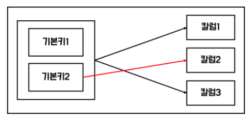
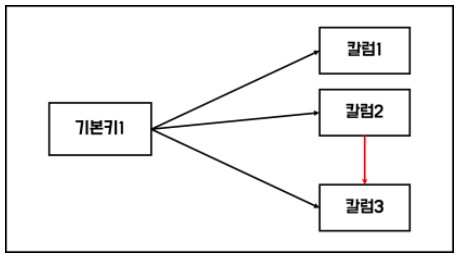

# SQL 자격검정 실전문제 오답
- SQLD를 위해 공부해봅시다.

## 1장 데이터 모델의 이해

### 1
#### 데이터 모델링의 특징

1. **추상화** : 일정한 형식에 맞추어 표현한다.
2. **단순화** : 제한된 표기법이나 언어로 표현한다.
3. **명확성** : 이해가 쉽게 표현한다.

모델링은 단지 시스템 구현만을 위해 수행하는 태스크가 아니며, 시스템 구현을 포함한 업무 분석 및 업무 형상화를 하는 목적도 있다.

#### 정답: 2

### 2
데이터 모델링은 단지 데이터베이스만을 구축하기 위한 용도로 쓰이는 것이 아니라 데이터 모델링 자체로도 업무를 설명하고 분석하는 부분에서 매우 중요한 의미가 있다.

#### 정답: 3

### 3
#### 데이터 모델링을 할 때 유의할 사항
1. **중복**
    - 데이터 모델은 같은 데이터를 사용하는 사람, 시간, 그리고 장소를 파악하는 데 도움을 주어 데이터베이스가 여러 장소에 같은 정보를 저장하는 잘못을 하지 않도록 한다.
    - 데이터 중복 저장 방지
2. **비유연성**
    - 데이터의 정의를 데이터의 사용 프로세스와 분리함으로써 데이터 모델링은 데이터 혹은 프로세스의 작은 변화가 애플리케이션과 데이터베이스에 중대한 변화를 일으킬 수 있는 가능성을 줄인다.
    - 데이터 정의와 데이터 사용 프로세스 분리
3. **비일관성**
    - 데이터 모델링을 할 때 데이터와 데이터 간의 상호 연관 관계에 대해 명확하게 정의하여 위험을 사전에 예방한다.

테이블 간의 연계성을 높이면 데이터 모델이 업무 변경에 대해 취약하게 만드는 단점에 해당한다. 비일관성을 유발할 수 있다.

#### 정답: 3

### 4
3번 풀이 참고

#### 정답: 2

### 5
#### DB의 3층 스키마
1. **외부 스키마**
    - 각 사용자 단계의 개인적 DB 스키마, 사용자 관점, 응용 프로그램이 접근하는 DB를 정의
2. **개념 스키마**
    - 조직 전체의 통합된 DB 스키마, 설계자 관점, 데이터 모델링의 지향점
    - 통합된 모든 사용자의 관점
3. **내부 스키마**
    - 물리적으로 데이터가 저장되는 방법을 표현하는 스키마, 개발자 관점, 물리적 저장 구조

#### DB의 3단계 구조
- 외부 단계, 개념적 단계, 내부적 단계
- 외부 단계와 개념적 단계 사이에서는 논리적 데이터 독립성 고려
- 개념적 단계와 내부적 단계 사이에서는 물리적 데이터 독립성 고려

View 단계는 여러 사용자 관점으로 구성하는 외부스키마에 해당한다.

#### 정답: 3

### 8
이건 그냥 보기에서 알아둬야 할 것들만 적어놔야겠다.

1. ERD에서 엔터티를 어디에 배치하는가에 대한 문제는 필수사항은 아니지만 가독성 측면에서 생각하여 적절하게 배치할 필요성이 있다. 일반적으로 사람의 눈은 **왼쪽에서 오른쪽, 위쪽에서 아래쪽**으로 이동하는 경향이 있기 때문에 데이터 모델링에서도 가장 중요한 엔터티를 **왼쪽 상단**에 배치하고 이것을 중심으로 다른 엔터티를 나열하면서 전개하면 사람의 눈이 따라가기에 편리한 데이터 모델을 작성할 수 있다.
2. 일반적으로 ERD를 작성할 때 **엔터티 도출 -> 엔터티 배치 -> 관계 설정 -> 관계명 기술** 의 흐름으로 작업을 진행한다.

#### 정답: 4

### 12
#### 발생 시점에 따른 엔터티의 분류
1. **기본 엔터티(Key Entity)**
    - 독립적으로 생성되는 엔터티
2. **중심 엔터티(Main Entity)**
    - 기본 엔터티와 행위 엔터티의 중간에 존재하는 엔터티
3. **행위 엔터티(Activity Entity, 사건 엔터티)**
    - 2개 이상의 부모 엔터티로부터 발생
    - 비즈니스 프로세스를 실행하면서 생성되는 엔터티
    - 지속적으로 정보가 추가되고 변경되어 데이터양이 가장 많다.

관계 엔터티라는 것은 과연 뭘까... 찾아봐도 딱히 나오는게 없는걸 보면 그냥 이상한 거 집어넣은 것 같다.

#### 정답: 1

### 13
#### 엔터티 명명 규칙
1. 현업업무에서 사용하는 용어
2. 약어 **지양**
3. 단수 명사
4. 유일성 보장
5. 명확성 - 엔터티 생성 의미대로 이름 부여

#### 정답: 1

### 15
#### 속성
- 엔터티가 가지는 최소 의미 단위, 인스턴스의 구성 요소
- 영어로만 공부했어서 헷갈리는데 Attribute이다.
- 엔터티에 대한 자세하고 구체적인 정보를 나타낸다.
- 하나의 엔터티는 두 개 이상의 속성을 갖는다.
- 하나의 인스턴스에서 각각의 속성은 하나의 속성값만 가져야 한다.
- 속성도 집합이다.

#### 엔터티, 인스턴스, 속성, 속성값의 관계
- 한 개의 엔터티는 두 개 이상의 인스턴스 집합이어야 한다.
- 한 개의 엔터티는 두 개 이상의 속성을 갖는다.
- 한 개의 속성은 한 개의 속성값을 갖는다.

#### 정답: 3

### 16
#### 정규화
1. **1차 정규화**
    - 도메인이 원자값
    - 속성의 원자성 확보
    - 다중값 속성을 분리
2. **2차 정규화**
    - 부분 함수 종속성 제거
    - 일부 기본키에만 종속된 속성을 분리
    - 기본키가 하나의 칼럼일 경우에는 생략
    - 부분 함수 종속인 경우
      
3. **3차 정규화**
    - 이행 함수 종속성 제거
    - 서로 종속 관계가 있는 일반 속성을 분리
    - 이행 함수 종속인 경우
      
4. **BCNF 정규화**
    - 후보키가 기본키 속성 중 일부에 함수 종속적일 경우 다수의 주식별자를 분리
    - 결정자 중 기본키가 아닌 것 제거 였나
    - 전에 전공 수업에서 배운 적이 있으니 찾아보자
5. **4차 정규화**
    - 다치 종속 분리
6. **5차 정규화**
    - 조인 종속 분리

먼저 문제의 DB는 모든 속성이 원자성을 띄므로 1차 정규형은 만족한다. 그러나 현재 주문상품 엔터티의 주문상품명은 주문상품 코드에만 종속적이다. 기본키가 주문번호와 주문상품코드 둘인데 둘 모두에 종속적이지 않으므로 이는 부분 함수 종속적, 즉 2차 정규화가 필요하고 2차 정규화를 진행한 것이다.

근데 나 이 문제 이해를 못하고 변경 전, 변경 후를 보지 못해서 이게 그냥 정규화가 안 되어 있는 것인 줄 알았어... 그렇게 생각하면 앞으로 새롭게 해야할 정규화는 3차 정규화긴 하네...

#### 정답: 2

### 20
아니 이걸 왜 틀린거야 빡대가리야 연관관계 항상 존재하는 관계고 의존관계는 일시적으로 존재하는 관계라는 것을 누가 몰라.

연관관계는 소스코드에서 멤버변수로 선언하여 사용하게 하고 의존관계는 오퍼레이션에서 파라미터 등으로 이용할 수 있도록 되어 있다.

#### 정답: 4

### 21
보기에 나와있는 것 위주로 알아보자.

#### 데이터 모델링의 관계에 대한 설명
1. 관게는 존재적 관계와 행위에 의한 관계로 나누어볼 수 있다.
    - 존재적 관계: 엔터티 간의 상태
    - 행위적 관계: 엔터티 간에 발생하는 행위
2. 관계의 표기법은 관계명, 관계차수, 선택성(선택사양)의 3가지 개념으로 표현한다.

#### 정답: 2

### 24
#### 두 개의 엔터티 사이에서 관계를 도출할 때 확인할 사항
1. 두 개의 엔터티 사이에 관심 있는 연관규칙이 존재하는가?
2. 두 개의 엔터티 사이에 정보의 조합이 발생되는가?
3. 업무기술서, 장표에 관계연결을 가능하게 하는 **동사(Verb)**가 있는가?
4. 업무기술서, 장표에 관계연결에 대한 규칙이 서술되어 있는가?

#### 정답: 3

### 27
#### 식별자의 분류
**대표성 여부에 따른 분류**
1. **주식별자**
    - 대표성을 만족하는 식별자
2. **보조 식별자**
    - 유일성과 최소성만 만족하는 식별자
    - 참조 관계 연결에 사용할 수 없다.

**생성 여부에 따른 분류**
1. **내부 식별자**
    - 자연스럽게 존재하는 식별자 (=본질식별자)
2. **외부 식별자**
    - 다른 엔터티와의 관계를 통해 생성되는 식별자

**속성 수에 따른 분류**
1. **단일 식별자**
    - 하나의 속성
2. **복합 식별자**
    - 여러 속성

**대체 여부에 따른 분류**
1. **본질 식별자**
    - 대체될 수 없는 식별자
2. **인조 식별자**
    - 인위적으로 만들어지는 대체 가능한 식별자
    - 후보 식별자 중 주식별자로 선정할 것이 없거나 주식별자가 너무 많은 칼럼으로 구성되어 있을 때 사용

일단 여기서 사원 엔터티의 특성에 해당하는 것은 아마 사원의 식별자인 사번의 특성에 대해서 물어보는 것 같다. 현재 사번은 사원 엔터티를 대표하므로 주식별자라고 할 수 있으며 사번 하나의 속성이 식별자로 사용되고 있으므로 단일 식별자이다. 또한 사번은 자연스럽게 존재하는 식별자이기 때문에 내부 식별자이다. 그리고 사번은 인위적으로 만들어지는 인조식별자가 아니다.

#### 정답: 4

### 30
#### 식별자에 따른 관계의 분류
1. **식별 관계**
    - 부모 엔터티의 식별자를 자식 엔터티에서 주식별자로 사용
        - 약한 엔터티: 부모 엔터티에 종속되어 존재
    - 강한 연결 관계 표현
    - 실선 표현
    - 반드시 부모 엔터티에 종속
    - 자식 주식별자 구성에 부모 주식별자 포함 필요
    - 상속받은 주식별자 속성을 타 엔터티에 이전 필요
2. **비식별 관계**
    - 부모 엔터티의 식별자를 자식 엔터티에서 일반 컬럼으로 참조 사용
    - 약한 종속 관계
    - 점선 표현
    - 자식 주식별자 구성을 독립적으로 구성
    - 자식 주식별자 구성에 부모 주식별자 부분 필요
    - 상속받은 주식별자 속성을 타 엔터티에 차단하는 것이 필요
    - 부모 쪽의 관계 참여가 선택관계

#### 데이터 모델링에서 비식별자 관계로 연결하는 경우
1. 엔터티와 엔터티가 1:M 관계의 부모와 자식관계에서 데이터가 부모 없이 자식쪽 엔터티의 인스턴스가 먼저 생성될 수 있을 경우 비식별자 관계로 연결해야 한다.
2. 부모 엔터티의 인스턴스가 자식 엔터티의 인스턴스보다 먼저 소멸하는 경우 비식별자 관게로 연결해야 한다.
3. 자식 엔터티의 식별자가 부모 엔터티의 주식별자를 상속받아 생성하는 것보다 별도의 주식별자를 생성하는 것이 더 유리하다고 판단되는 경우 비식별자 관계로 연결해야 한다.
    - 당연한 밀이지 비식별자 관계 자체가 자식 엔터티가 별도의 주식별자를 독립적으로 구성하는 것이니까

SQL문의 조인 관계를 최소화 하는 경우 식별자 관계로 연결해야 한다. 왜지? 일단 그렇다고 한다.

#### 정답: 3

### 31
전체적인 풀이는 27번의 풀이를 보면 된다. 다시 풀었을 때 맞았다.

#### 정답: 3

## 2장 데이터 모델과 SQL
### 34
현재 ab는 당연히 자기 자신인 ab를 결정하고 추가로 cde도 결정하므로 후보 키가 될 수 있다.

d는 ab를 결정하고 ab는 cde를 결정하므로 d는 모든 속성을 결정할 수 있다. 즉 후보 키가 될 수 있다.

e->b 이므로 ae->ab이다. 또한 ab->cde 이므로 ae는 모든 속성을 결정할 수 있으며 후보 키가 될 수 있다.

이렇게 차근차근 생각해보니까 또 쉽네. 다음에 똑같이 나오면 풀 수 있을 것 같다.

#### 정답: 3

### 38
현재 모델 테이블에는 유형기능분류코드가 엄청나게 반복되고 있다. **칼럼에 의한 반복적인 속성값을 갖는 형태는 속성의 원자성을 위배한 1차 정규화의 대상**이 된다. 이와 같은 반복적인 속성 나열 형태에서는 각 속성에 대해 'or' 연산자로 연결된 조건들이 사용되는데, 이때 어느 하나의 속성이라도 인덱스가 정의되지 않으면 'or'로 연결된 모든 조건절들이 인덱스를 사용하지 않고 한 번의 전체 데이터 스캔으로 처리되게 되어 성능 저하가 나타날 수 있다. 또한 모든 반복 속성에 인덱스를 생성하면 검색 속도는 좋아지겠지만 반대로 너무 많은 인덱스 때문에 입력, 수정, 삭제의 성능이 저하되므로, 1차 정규화로 자연스럽게 문제가 해결될 수 있도록 해야 한다.

무슨 말인지 알겠다. 우선 칼럼에 의한 반복적인 속성값을 갖는 형태도 속성의 원자성을 위배한 1차 정규화의 대상이라는 것을 알아둬야겠다.

#### 정답: 4

### 39
이건 진짜 어떻게 푸는거지 왜 7개인거지

우선 제 1차 정규화를 통해서 학생 테이블이 학생이랑 LAB실 이용신청 테이블 2개로 나눠지는 건 ok. LAB실 이용 신청 테이블도 지금 보니까 교수도 너무 반복되니까 나눠야겠다. 그러면 학생, LAB실이용신청, 교수 이렇게 3개. 그리고 학과명은 학과번호에 의해 결정될 수 있는데 학과번호는 식별자가 아니니까 얘도 따로 빼자. 그러면 학생 학과, LAB실 이용신청, 교수 이렇게 4개. 학생 테이블은 이정도로 정리하면 될 것 같다.

이번에는 도서대출 테이블. 도서 테이블은 우선 대출도서번호랑 대출도서명이 서로 종속적이므로 빼놔야하니까 대출, 대출도서 로 2개. 답지에 따르면 여기에 추가로 일반 도서 테이블이랑 대출도서 테이블을 나눠서 3개로 나누라고 했는데... 아직은 잘 모르겠다...

#### 정답: 3

### 41
#### 정규화
- **논리** 데이터 모델 상세화 과정의 대표적인 활동
- 논리 데이터 모델의 일관성을 확보하고 중복을 제거하여 속성들이 가장 적절한 엔터티에 배치되도록 한다.
    - 보다 더 신뢰성 있는 데이터구조

개념 데이터 모델이 아니라 논리 데이터 모델이다!!!! 당연한거지!!!

#### 정답: 1

### 46
NULL에 대한건 특별히 배운 적이 없는데 생각보다 잘 맞았네 문제가 나오면...

#### NULL의 특성
- NULL은 아직 정의되지 않은 값으로 0 또는 공백과 다르다.
    - 0은 숫자, 공백은 하나의 문자
- 테이블을 생성할 때 NOT NULL 또는 PRIMARY KEY로 정의되지 않은 모든 데이터 유형은 NULL 값을 포함할 수 있다.
- NULL 값을 포함하는 연산의 경우 결괏값도 NULL 값이다.
    - 모르는 데이터에 숫자를 더하거나 빼도 결과는 마찬가지로 모르는 데이터인 것과 동일
- 결괏값을 NULL이 아닌 다른 값을 얻고자 할 때 NVL/ISNULL 함수를 사용한다.
    - NULL 값의 대상이 숫자 유형 데이터인 경우 주로 0으로, 문자 유형 데이터인 경우는 공백보다는 'x' 같이 해당 시스템에서 의미 없는 문자로 바꾸는 경우가 많다.

#### 정답: 3

### 47
정규화를 수행하면 일반적으로 검색 작업의 성능이 저하된다고 한다.

근데 그게 중요한게 아니라 왜 이게 제2정규화를 수행한 것이지? 왜 제3정규화가 아닌거야? 아 진짜 도저히 모르겠네... 일단 넘어가자

#### 정답: 2

### 48
뭔가 이거는 가장 적절하지 않은 걸 고르라고 한 것 같은데.... 왜냐하면 나머지도 다 맞는 것 같고 오히려 답지에서는 A와 B가 하나의 트랜잭션으로 묶여 처리가 되어야 하므로 커밋은 A와 B를 모두 수행한 다음에 해주어야 한다고 하고... 이것도 나중에 찾아봐야겠다 뭔지...

#### 정답: 2

### 49
일단 전체적인건 46번 풀이를 보면 되고 추가적으로 정리할 것!

#### NULL의 특징
1. NULL 값과 어떤 숫자를 비교한 결과는 항상 **unknown**이다.
2. `NULL = NULL` 연산의 결과는 **FALSE** 또는 **unknown**이다.
3. 집계 함수를 계산할 때 NULL 값은 0으로 처리되는 것이 아닌 계산에서 제외된다.

#### 정답: 1
